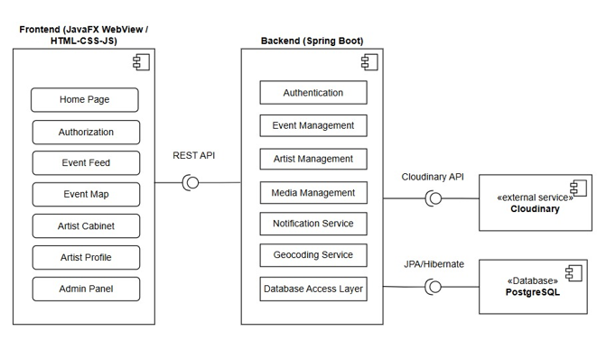

# Architecture

## Overview

StreetArt Live is built using a client-server architecture that separates presentation, business logic, and data storage responsibilities.

The system consists of:

* Frontend layer
* Backend layer
* Database layer
* External services



---

## High-Level Architecture

```text
Desktop Application
(JavaFX WebView)
        │
        ▼
Frontend
(HTML / CSS / JavaScript)
        │
        ▼
REST API
(Spring Boot)
        │
        ▼
PostgreSQL Database
```

External integrations:

* Leaflet.js
* Cloudinary
* SMTP Email Service

---

## Frontend Layer

The user interface is implemented using:

* HTML5
* CSS3
* JavaScript

Main responsibilities:

* User interaction
* Form validation
* Event filtering
* Artist filtering
* Dynamic content rendering
* Interactive map integration

---

## Desktop Integration

The web interface is embedded into a desktop environment using JavaFX WebView.

Benefits:

* Single codebase for the interface
* Native desktop deployment
* Seamless integration with Java ecosystem

---

## Backend Layer

The backend is implemented using Spring Boot.

Responsibilities:

* Authentication and authorization
* Business logic processing
* Data validation
* Event moderation
* Subscription management
* Notification management
* REST API endpoints

Main technologies:

* Spring Boot
* Spring Data JPA
* Hibernate

---

## Database Layer

PostgreSQL is used as the primary data storage system.

Stored data includes:

* User accounts
* Artist profiles
* Event requests
* Approved events
* Subscriptions

Detailed database structure is available in database.md.

---

## Interactive Map

StreetArt Live uses Leaflet.js for event visualization.

Features:

* Display approved events on a map
* Marker-based navigation
* Event location visualization
* Theme synchronization

---

## Media Storage

Artist avatars are stored using Cloudinary.

Benefits:

* Cloud-based storage
* Media optimization
* Reduced server load

---

## Email Notifications

The application sends notifications to artist subscribers when an event is approved.

Implementation:

* JavaMailSender
* SMTP integration

---

## Security

Security measures include:

* Password hashing
* Role-based access control
* Request validation
* Protected administrative functionality

User roles:

* User
* Artist
* Administrator
