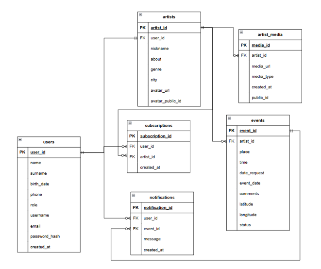

# Database Structure

## Overview

StreetArt Live uses PostgreSQL as the primary database management system.

The database stores information about users, artist profiles, events, subscriptions, and moderation data.

---

## Entity Relationship Diagram



---

## Main Entities

### Users

Stores application user accounts and authentication data.

| Field         | Description        |
| ------------- | ------------------ |
| user_id       | Primary key        |
| username      | Unique username    |
| email         | User email address |
| password_hash | Encrypted password |
| role          | User role          |
| name          | First name         |
| surname       | Last name          |
| phone         | Contact phone      |
| date_of_birth | Birth date         |

---

### Artists

Stores artist-specific information.

| Field            | Description           |
| ---------------- | --------------------- |
| artist_id        | Primary key           |
| user_id          | Related user          |
| nickname         | Public artist name    |
| genre            | Artist category       |
| city             | Artist city           |
| about            | Artist description    |
| avatar_url       | Avatar URL            |
| avatar_public_id | Cloudinary identifier |

Relationship:

```text
User (1) ─── (0..1) Artist
```

Each artist profile belongs to a single user account.

---

### Events

Stores event requests and approved performances.

| Field      | Description       |
| ---------- | ----------------- |
| event_id   | Primary key       |
| user_id    | Event creator     |
| place      | Event location    |
| event_date | Event date        |
| time       | Event time        |
| comments   | Event description |
| status     | Moderation status |
| decision   | Moderator comment |
| latitude   | Latitude          |
| longitude  | Longitude         |

Relationship:

```text
Artist/User (1) ─── (*) Events
```

An artist can create multiple event requests.

---

### Subscriptions

Stores relationships between users and artists.

| Field     | Description       |
| --------- | ----------------- |
| viewer_id | Subscriber        |
| artist_id | Subscribed artist |

Relationship:

```text
Users (*) ─── (*) Artists
```

Implemented through a junction table.

---

## User Roles

The system supports role-based access control.

Available roles:

### User

Can:

* Browse artists
* Browse events
* Subscribe to artists

### Artist

Can:

* Manage artist profile
* Create event requests

### Administrator

Can:

* Moderate event requests
* Approve or reject events

---

## Data Flow

### Event Creation

```text
Artist
   │
   ▼
Event Request
   │
   ▼
Pending Status
   │
   ▼
Admin Review
   │
   ├── Approved
   └── Rejected
```

---

### Subscription Flow

```text
User
   │
   ▼
Subscribe to Artist
   │
   ▼
Subscription Record
   │
   ▼
Receive Event Notifications
```

---

## Database Design Goals

The database was designed to:

* Support role-based access control
* Maintain normalized data structure
* Enable efficient event filtering
* Support subscription management
* Simplify future feature expansion
